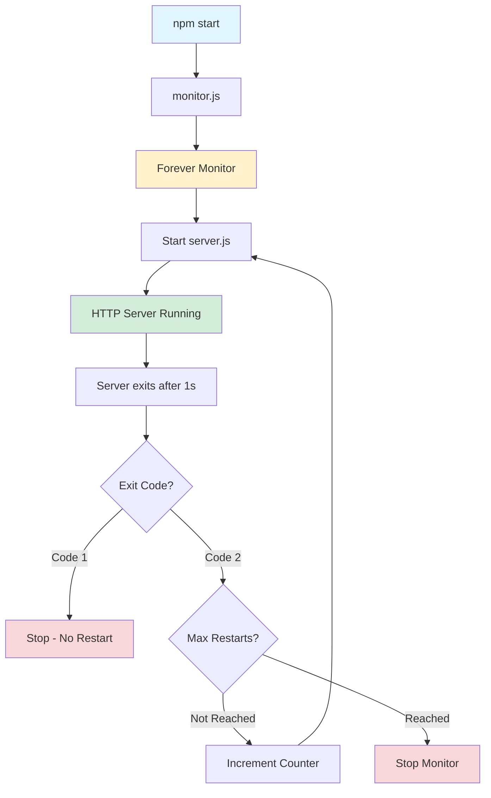

# Node Test Restart

A Node.js test application demonstrating the `forever-monitor` NPM package's automatic process restart capabilities. This project creates a simple HTTP server that deliberately exits to showcase how forever-monitor detects crashes and restarts the process automatically.

Built in November 2020. This application helps developers understand how to implement automatic process restart and recovery in Node.js applications.

## Features

- 🔄 Automatic process restart on crash/exit
- 📊 Restart counter tracking
- 🎯 Configurable restart limits
- 🚦 Exit code-based restart control
- ⚙️ Simple HTTP server for testing
- 📝 Error handling and logging

### Core Capabilities

- **Automatic Process Restart**: Automatically recovers from crashes and exits.
- **Restart Counter Tracking**: Monitors and injects the number of restarts into the child process.
- **Configurable Limits**: Easily adjust maximum restart attempts and monitoring behavior.
- **Exit Code Logic**: Intelligent handling of different exit codes for granular control.

### Technical Excellence

- **Process Supervision**: Implements a robust supervisor-worker architecture.
- **Decoupled Design**: Separates monitoring logic from application business logic.
- **Resource Efficiency**: Minimal overhead for the supervisor process.
- **Error Handling**: Graceful termination and error reporting using specialized libraries.

### Developer Experience

- **Simple Setup**: Minimal configuration required to get started.
- **Integrated Debugging**: Built-in support for Node.js inspector and debug mode.
- **Clear Documentation**: Detailed architecture diagrams and process flow explanations.
- **Environment Aware**: Configurable settings for different deployment scenarios.

## Getting Started

### Prerequisites

- Node.js (v8 or higher)
- npm or yarn

### Installation

1. Clone the repository:

```bash
git clone https://github.com/orassayag/node-test-restart.git
cd node-test-restart
```

2. Install dependencies:

```bash
npm install
```

### Quick Start

Run the monitor to see automatic restarts in action:

```bash
npm start
```

## Usage

### Running the Monitor

The primary way to run the application is through the monitor:

```bash
npm start
```

### Stopping Processes

To stop all Node.js processes (especially useful on Windows):

```bash
npm run stop
```

### Debugging

To run the server in debug mode without the monitor:

```bash
npm run debug
```

The server will:

1. Start on port 3001
2. Exit after 1 second with code 2
3. Automatically restart (up to 10 times)
4. Display restart count each time

## How It Works

### Architecture Diagram



### Process Flow

1. **Monitor Initialization**: `monitor.js` creates a forever-monitor instance
2. **Server Start**: Monitor spawns `server.js` process
3. **HTTP Server**: Server listens on configured port (default: 3001)
4. **Deliberate Exit**: After 1 second, server exits with code 2
5. **Monitor Detection**: Forever-monitor detects the exit
6. **Restart Decision**: Based on exit code and restart count
7. **Process Restart**: Monitor restarts the server with incremented counter
8. **Repeat**: Process continues until max restarts reached

### Exit Code Behavior

| Exit Code   | Behavior                               |
| ----------- | -------------------------------------- |
| 1           | Monitor stops - no restart             |
| 2 or other  | Monitor restarts process automatically |
| Max reached | Monitor stops regardless of exit code  |

## Architecture Principles

- **Resilience by Design**: The system assumes processes will fail and provides an automated recovery path.
- **Single Responsibility**: The monitor manages process lifecycle, while the server handles application logic.
- **Observability**: Every restart and exit event is captured and logged for analysis.
- **Configurability**: All operational parameters are externalized from the core logic.

## Design Patterns

- **Supervisor Pattern**: A dedicated process monitors the health of worker processes and restarts them on failure.
- **Worker Process**: The application logic runs in a sandboxed child process.
- **Singleton Configuration**: Centralized settings management ensures consistency across the application.

## Configuration

Edit `src/settings/settings.js`:

```javascript
const settings = {
  NODE_ENV: 'development', // Environment mode
  SERVER_PORT: '3001', // HTTP server port
};
```

Edit `src/monitor.js`:

```javascript
const child = new forever.Monitor('server.js', {
  max: 10, // Maximum number of restarts
  silent: false, // Show/hide output
  args: [restartCount], // Arguments passed to server
});
```

## Available Scripts

### Start Monitor

```bash
npm start
```

Starts the forever-monitor which automatically restarts the server.

### Stop All Node Processes (Windows)

```bash
npm run stop
```

Forcefully stops all Node.js processes using taskkill.

### Debug Mode

```bash
npm run debug
```

Starts the server with Node.js inspector for debugging.

## Project Structure

```
node-test-restart/
├── src/
│   ├── monitor.js           # Forever-monitor configuration
│   ├── server.js            # HTTP server (exits deliberately)
│   ├── settings/
│   │   └── settings.js      # Configuration settings
│   └── services/
│       └── error.service.js # Error handling utilities
├── server.js                # Entry point
├── package.json
└── README.md
```

## Directory Structure

- **src/**: Contains the core source code of the application.
- **src/monitor.js**: The main supervisor script that configures and runs `forever-monitor`.
- **src/server.js**: The HTTP server implementation that includes the intentional exit logic.
- **src/settings/**: Contains configuration files for environment and server settings.
- **src/services/**: Helper services, including error formatting and handling.
- **.github/**: GitHub-specific configuration, including repository rulesets.
- **.vscode/**: Workspace-specific settings for Visual Studio Code.

## Testing Scenarios

### Scenario 1: Normal Restart

1. Run `npm start`
2. Observe server starting, exiting, and restarting
3. Restart counter increments with each restart

### Scenario 2: Max Restarts Limit

1. Change `max: 3` in `src/monitor.js`
2. Run `npm start`
3. Monitor stops after 3 restarts

### Scenario 3: Exit Code 1 (No Restart)

1. Change `process.exit(2)` to `process.exit(1)` in `src/server.js`
2. Run `npm start`
3. Monitor does NOT restart the server

### Scenario 4: Custom Port

1. Change `SERVER_PORT` in `src/settings/settings.js`
2. Run `npm start`
3. Server starts on the new port

## Development

The project uses:

- **JavaScript (Node.js)** with ES6+ features
- **forever-monitor** for process management
- **death** for graceful process termination
- **ESLint** for code quality

## Use Cases

This pattern is useful for:

- **Production servers**: Automatic recovery from crashes
- **Long-running processes**: Keep services alive

## Best Practices

- **Graceful Shutdown**: Always use the `death` package or similar to handle process termination signals.
- **Limit Restarts**: Set a reasonable `max` restart limit to prevent infinite loops in case of unrecoverable errors.
- **Exit Codes**: Use meaningful exit codes to differentiate between various types of failures.
- **Logging**: Ensure all process events (starts, restarts, exits) are logged for easier troubleshooting.

## Support

If you encounter any issues or have questions about this project:

- **Issues**: Report bugs or request features via [GitHub Issues](https://github.com/orassayag/node-test-restart/issues).
- **Author**: Or Assayag ([orassayag@gmail.com](mailto:orassayag@gmail.com))
- **GitHub**: [@orassayag](https://github.com/orassayag)
- **Development testing**: Test restart/recovery logic
- **Microservices**: Ensure service availability
- **Background jobs**: Auto-restart failed workers

## Common Issues

### Port Already in Use

If port 3001 is in use:

- Change `SERVER_PORT` in settings
- Or stop the conflicting process
- On Windows: `npm run stop`

### Monitor Won't Stop

- Press `Ctrl+C` to stop
- On Windows: `npm run stop`
- Check `silent: false` for visibility

### No Console Output

- Set `silent: false` in `src/monitor.js`
- Run with `npm start` not `node server.js`

## Contributing

Contributions to this project are [released](https://help.github.com/articles/github-terms-of-service/#6-contributions-under-repository-license) to the public under the [project's open source license](LICENSE).

Everyone is welcome to contribute. Contributing doesn't just mean submitting pull requests—there are many different ways to get involved, including answering questions and reporting issues.

Please feel free to contact me with any question, comment, pull-request, issue, or any other thing you have in mind.

## Author

- **Or Assayag** - _Initial work_ - [orassayag](https://github.com/orassayag)
- Or Assayag <orassayag@gmail.com>
- GitHub: https://github.com/orassayag
- StackOverflow: https://stackoverflow.com/users/4442606/or-assayag?tab=profile
- LinkedIn: https://linkedin.com/in/orassayag

## License

This application has an MIT license - see the [LICENSE](LICENSE) file for details.

## Acknowledgments

- Built for educational and research purposes
- Respects robots.txt and implements rate limiting
- Uses user-agent rotation to avoid detection
- Implements polite crawling practices
